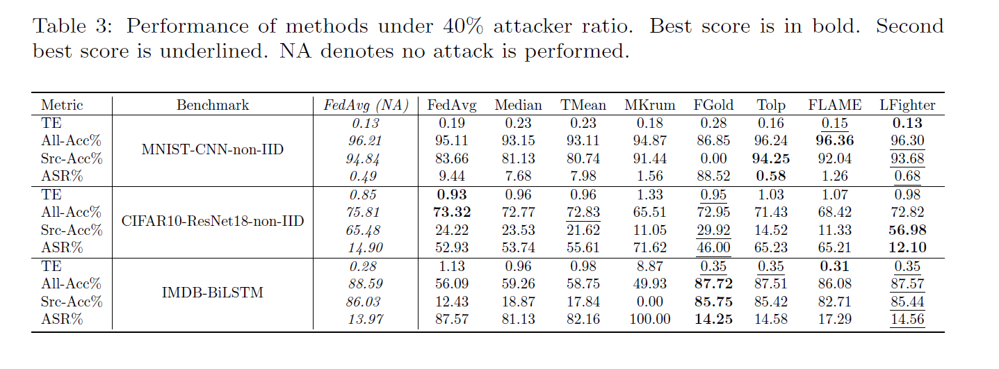
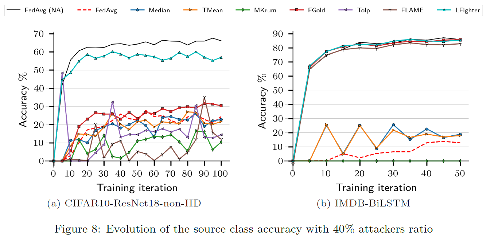

# LFighter: Defending against Label-Flipping Attacks in Federated Learning

[](https://www.sciencedirect.com/science/article/abs/pii/S0893608023006421)
[](https://www.anaconda.com/download)
[](https://pytorch.org/)
[](LICENSE)

> Official PyTorch implementation of the paper **"LFighter: Defending against the Label-Flipping Attack in Federated Learning"**, published in *Neural Networks*, vol. 170, pp. 111–126, 2024.

---

## Overview

**LFighter** is a robust aggregation defense mechanism designed to protect federated learning systems against label-flipping attacks — a class of data poisoning attacks in which malicious participants (clients) deliberately mislabel training samples to corrupt the global model's behavior on specific target classes.

This repository provides a fully reproducible implementation of all experiments reported in the paper across three benchmark datasets and multiple model architectures, under both IID and non-IID data distributions with up to 40% malicious participants.

---

## Paper

**LFighter: Defending against the Label-Flipping Attack in Federated Learning**  
Najeeb M. Jebreel, Josep Domingo-Ferrer, David Sánchez, Alberto Blanco-Justicia  
*Neural Networks*, vol. 170, pp. 111–126, Elsevier, 2024  
🔗 [Read on ScienceDirect](https://www.sciencedirect.com/science/article/abs/pii/S0893608023006421)

---

## Repository Structure

```
LFighter/
├── MNIST/                  # Notebook and utilities for the MNIST benchmark
├── CIFAR10/                # Notebook and utilities for the CIFAR-10 benchmark
├── IMDB/
│   ├── data/               # Place imdb.csv here after manual download
│   └── ...                 # Notebook and utilities for the IMDB benchmark
├── figures/                # Result figures referenced in this README
│   ├── main_results.PNG
│   └── stability_all.PNG
└── README.md
```

Each benchmark is self-contained in its own directory as a Jupyter notebook with clear inline instructions for reproducing the corresponding experiments from the paper.

---

## Installation

### Prerequisites

| Dependency | Version |
|---|---|
| [Python](https://www.anaconda.com/download) | ≥ 3.6 |
| [PyTorch](https://pytorch.org/) | ≥ 1.6 |
| [TensorFlow](https://www.tensorflow.org/) | ≥ 2.0 |

### Setup

```bash
git clone https://github.com/<your-username>/LFighter.git
cd LFighter
pip install -r requirements.txt
```

---

## Datasets

| Dataset | Access | Notes |
|---|---|---|
| [MNIST](http://yann.lecun.com/exdb/mnist/) | Automatic | Downloaded via PyTorch/TensorFlow data loaders |
| [CIFAR-10](https://www.cs.toronto.edu/~kriz/cifar.html) | Automatic | Downloaded via PyTorch/TensorFlow data loaders |
| [IMDB](https://ai.stanford.edu/~amaas/data/sentiment/) | Manual | See instructions below |

### IMDB Manual Setup

1. Download the preprocessed dataset from [Google Drive](https://drive.google.com/file/d/1CpT7RbswI-pGd4rVfWsgONf7qJQizON0/view?usp=sharing).
2. Save the file as `imdb.csv` in the following path:

```
LFighter/IMDB/data/imdb.csv
```

---

## Reproducing Experiments

Open the Jupyter notebook corresponding to the benchmark of interest and follow the inline instructions:

```bash
jupyter notebook MNIST/lfighter_mnist.ipynb
jupyter notebook CIFAR10/lfighter_cifar10.ipynb
jupyter notebook IMDB/lfighter_imdb.ipynb
```

Each notebook is fully self-contained and walks through data loading, federated training, attack simulation, and defense evaluation.

---

## Results

### Attack Robustness

The table below reports LFighter's classification robustness under a label-flipping attack with **40% malicious participants**, compared against baseline aggregation strategies.



### Source Class Accuracy Stability

The figure below shows the per-round source class accuracy under the label-flipping attack (40% attackers) for the **CIFAR-10/ResNet-18/non-IID** and **IMDB/BiLSTM** settings, illustrating LFighter's training stability relative to undefended baselines.



---

## Citation

If you use this code or build upon this work, please cite:

```bibtex
@article{jebreel2024lfighter,
  title     = {LFighter: Defending against the label-flipping attack in federated learning},
  author    = {Jebreel, Najeeb Moharram and Domingo-Ferrer, Josep and S{\'a}nchez, David and Blanco-Justicia, Alberto},
  journal   = {Neural Networks},
  volume    = {170},
  pages     = {111--126},
  year      = {2024},
  publisher = {Elsevier}
}
```

---

## Funding

This research was supported by:

- **European Commission** — H2020-871042 (*SoBigData++*) and H2020-101006879 (*MobiDataLab*)
- **Government of Catalonia** — ICREA Acadèmia Prizes (J. Domingo-Ferrer, D. Sánchez); FI doctoral grant (N. Jebreel)
- **MCIN/AEI** (10.13039/501100011033) and *ERDF A way of making Europe* — grant PID2021-123637NB-I00 (*CURLING*)

---

## Affiliation

Developed at the **[CRISES Research Group](https://crises-deim.urv.cat/)**, [Universitat Rovira i Virgili (URV)](https://www.urv.cat/en/), Tarragona, Catalonia.
